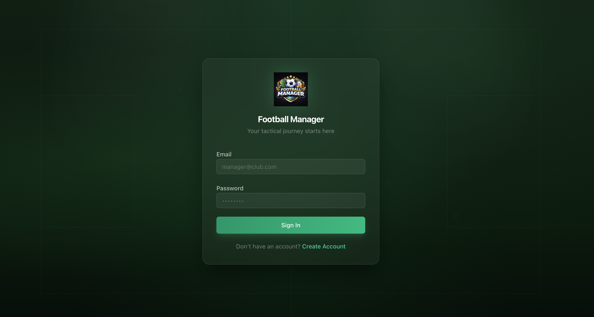
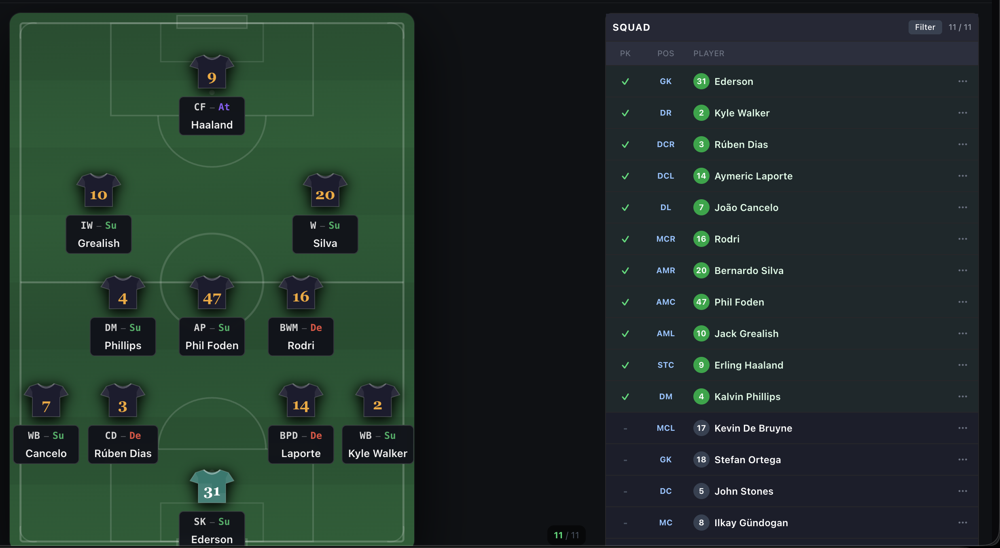

# ⚽ Football Manager UI

A modern, feature-rich **Football Manager**-style web application built with React, TypeScript, and Vite. The project replicates the look and feel of a professional football management game — including tactics, inbox, transfers, squad management, finances, scouting, and much more.

---

## 📸 Screenshots

### Auth Flwo


### Tactics — Pitch View


### News Feed


---

## 🛠️ Tech Stack

- **React 19** + **TypeScript**
- **Vite** (with SWC)
- **Tailwind CSS v4**
- **React Router v7** — lazy-loaded module routing
- **next-themes** — dark / light / system theme support
- **Lucide React** — icon library
- **Sonner** — toast notifications
- **react-top-loading-bar** — page transition indicator
- **Radix UI** — accessible primitives

---

## 🚀 Getting Started

```bash
# Install dependencies
npm install

# Configure API base URL
echo "VITE_API_BASE_URL=http://api.manager.localhost/api/v1" > .env.local

# Start development server
npm run dev

# Build for production
npm run build

# Preview production build
npm run preview
```

---

## 📁 Project Structure

```
src/
├── modules/          # Feature modules (inbox, team, tactics, scouting, …)
│   ├── inbox/
│   ├── team/
│   ├── tactics/
│   ├── transfers/
│   └── …
├── layout/           # Shared layout components
├── components/       # Shared UI components
├── providers/        # Module routing provider
├── hooks/            # Custom React hooks
├── lib/              # Utilities (cn, helpers)
└── styles/           # Global CSS / SCSS
```

---

## 🎨 Theming

The app supports **light**, **dark**, and **system** themes via `next-themes`. The theme preference is persisted in `localStorage` under the key `vite-theme`.

---
